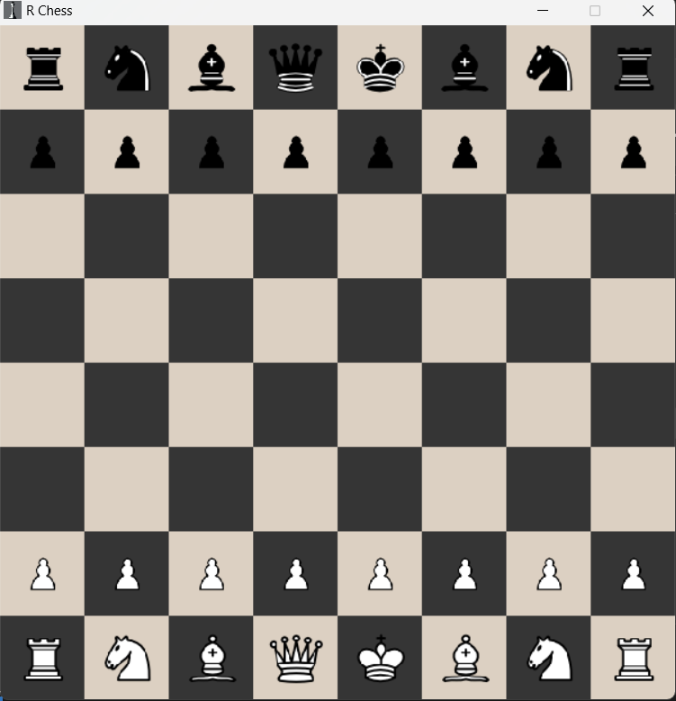
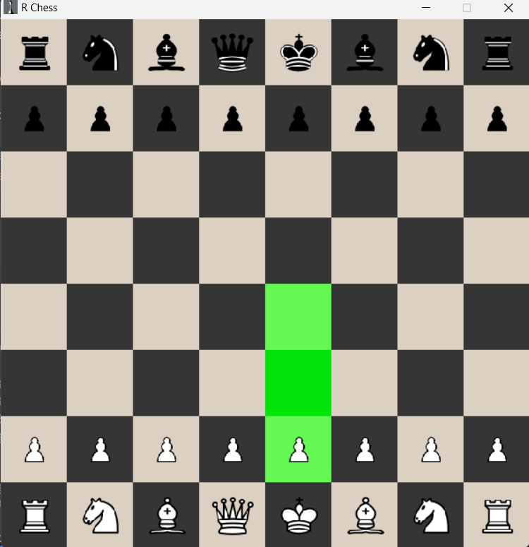
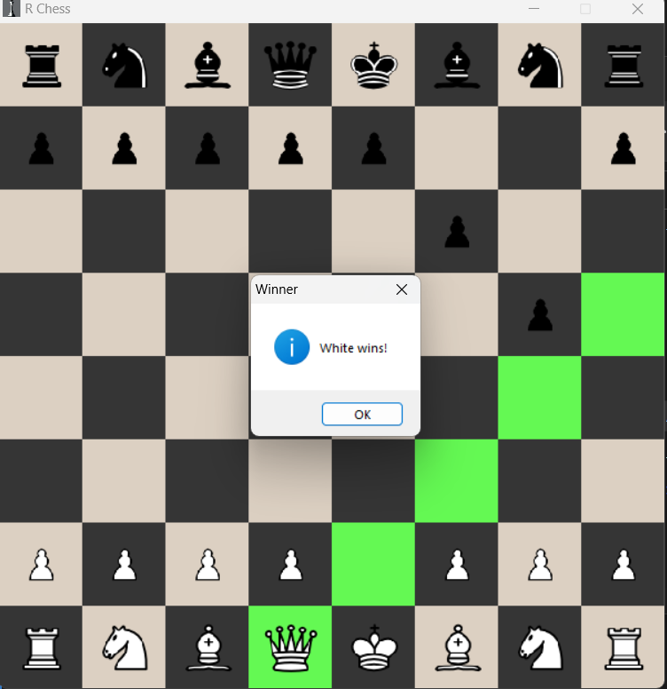

# Chess in pygame


## Documentation
This chess game is just a normal offline multiplayer chess game.
I made this game by References from [ThePythonCode](https://www.thepythoncode.com/article/make-a-chess-game-using-pygame-in-python)


## Usage
Just simply run the main.py file
```python
python main.py
```

<div class="chess-imgs">

## Some Photos

<hr>
<fieldset>
  
### At start

<br>
 
</fieldset>
<hr>
<fieldset>

### Running

<br>
 
</fieldset>
<hr>
<fieldset>

### CheckMate

<br>
<span>The Queen has been placed at h5 and showing checkmate massage<span><br><br>
 
</fieldset>
<hr>
</div>
<span style="padding: 30px">

>If you update this game or make any chenges that makes this game better then let me know at <span style="color: lightblue;">solanki.rohit6105@gmail.com</span>
</span>
